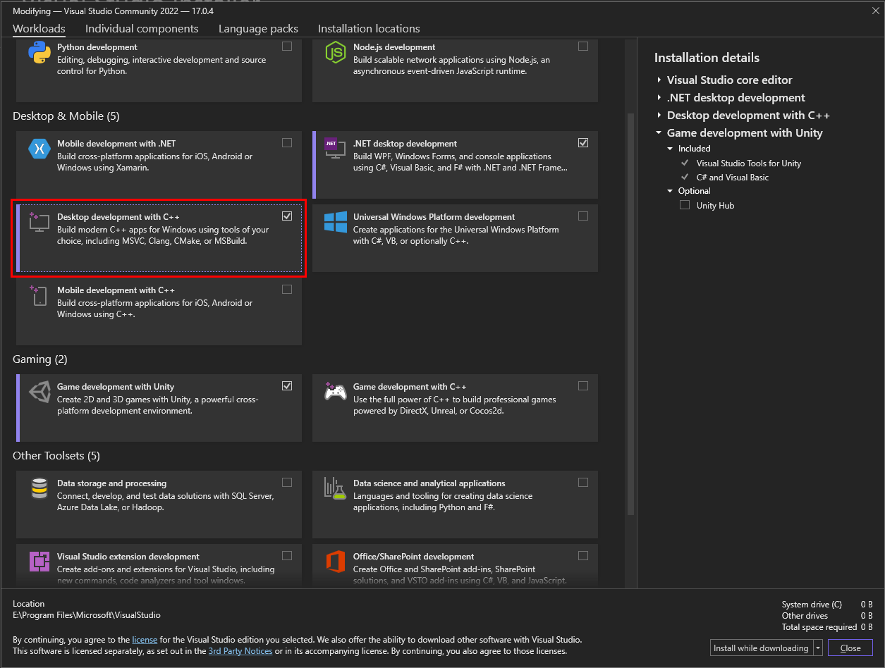
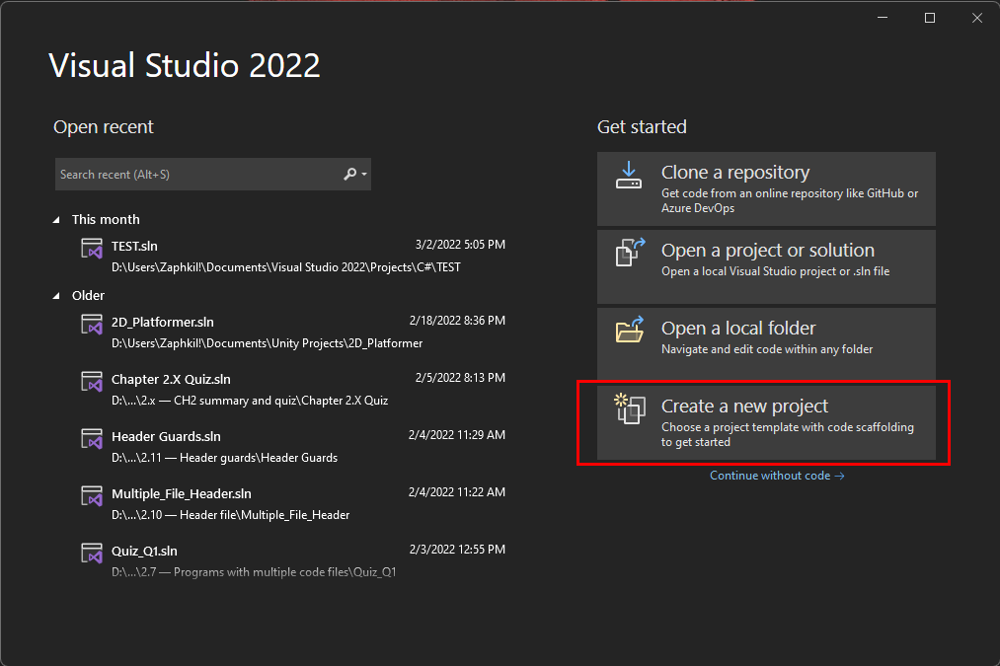
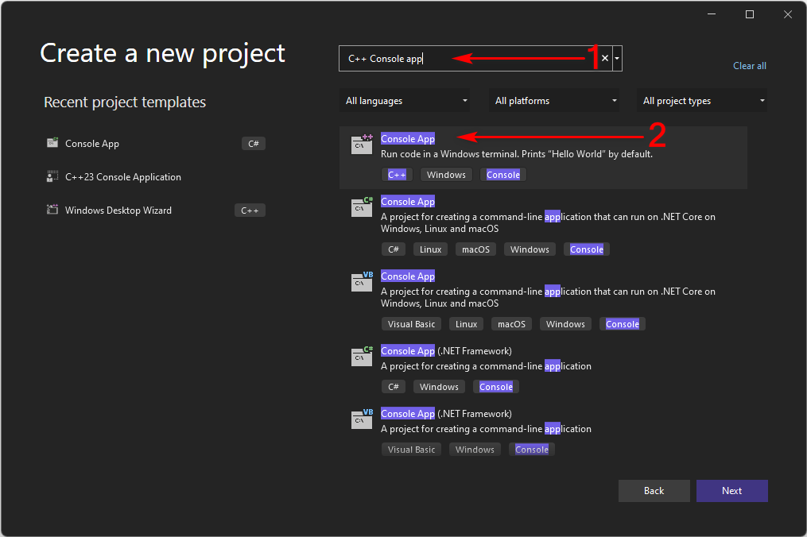
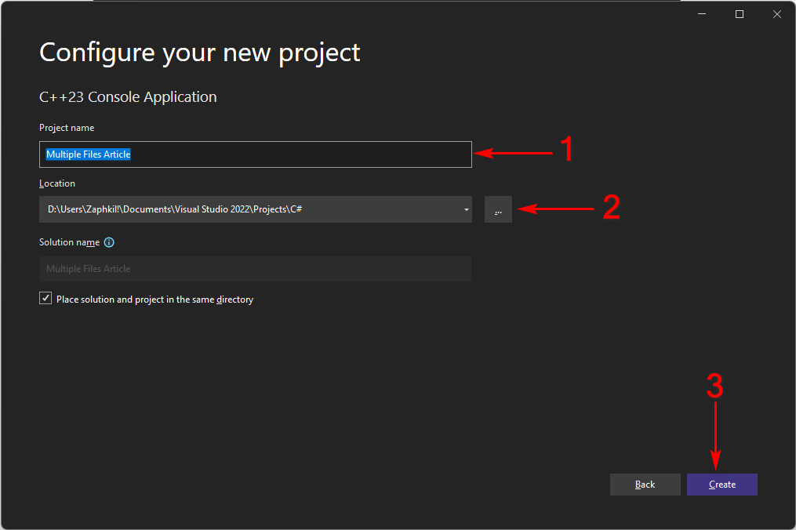
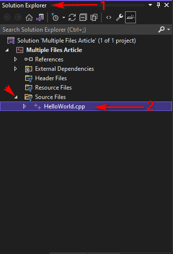
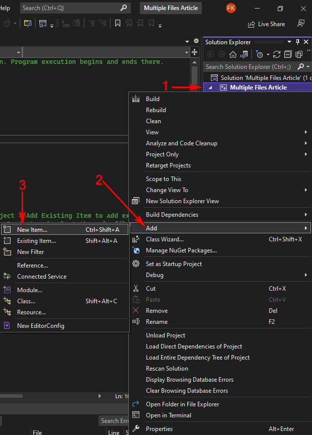
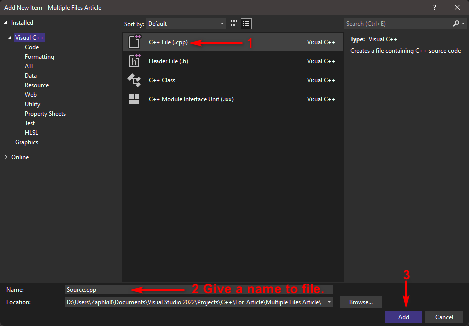
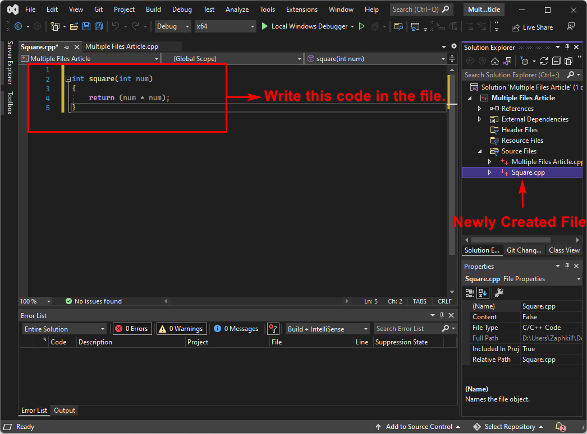
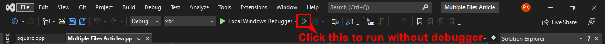
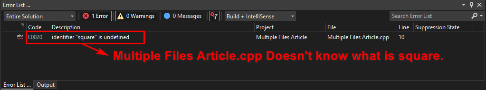

<h1 align="center"> How to use multiple code files in C++ for beginners.</h1>

# Introduction

When we code in a programming language, if our code is a small console
application, then we can easily make this in a single file. But, once
our program gets larger. We should split our programs in multiple files
for easy maintainability and reusability of our code.

To do this, we strongly recommend using an IDE. this will greatly ease
the process. Although you can also use [Visual studio
code](https://code.visualstudio.com/), we suggest you use [Visual studio
Community](https://visualstudio.microsoft.com/vs/community/) (it is
free) In this article we will be using [Visual studio
Community](https://visualstudio.microsoft.com/vs/community/).

# Requirements

  - Visual Studio Community
    
      - Desktop development with C++ workload

> 

  - Basic Knowledge of C++

**NOTE: I WILL NOT BE COVERING HOW TO INSTALL OR STEP UP VISUAL STUDIO
COMMUNITY IN THIS ARTICLE.**

# Step-by-step instructions

Step 1 – Launch Visual Studio Community by Double clicking on its icon
or ***right click/open.***

Step 2 – Click on ***create a new Project.***



Step 3 – Search for ***C++ Console app*** and ***Click*** on it.



Step 4 – Put your ***Project name*** and a ***location*** in the fields.
And click ***create***.



Now VSCommunity will create a solution for you.

Solutions: A solution is simply a container Visual Studio uses to
organize one or more related projects.

Step 5 – When VSCommunity Editor opens up. Look for ***Solution
Explorer***, its either in RHS or LHS. In ***solution explorer*** click
of ***Source files*** and you will see a intial file that the vs code
provides. And it will open the hello world program in editor



Step 6 – Create a ***new item***. By right clicking Project in
***solution explorer*** then click ***Add*** and in next option menu
click on ***new item***.



Step 7 – Select ***C++ File (.cpp)*** File. Give the new file a name(we
will use “square”), and it will be added to your project.



In newly created c++ file, For the sake of simplicity, We will write a
function that take one integer number as parameter and than returns the
square of given integer number.



  - Now edit the Main File(“Multiple Files Article.cpp”) that
    VSCommunity Provided us to use the function Square we have just
    created.

Now we have 2 files in our solution

Multiple Files Article.cpp
```cpp
#include <iostream>

int main()

{

  int num = 0;

  std::cout << "The a number to find it's square: ";

  std::cin >> num;

  std::cout << "The square of the number" << num << " is "<<square(num);

}
```
Squre.cpp
```cpp
int square(int num)

{

  return (num \* num);

}
```
If You tried to run the program now.

(To run the code, on the menu bar, choose Debug, ***Start without
debugging***. A console window opens and then runs your app.)



Vscommunity will compile either ***Multiple Files Article.cpp*** first
or ***Square.cpp*** first either way it will throw an error.



Compiler compiles the file individually and don’t know/remembers the
contents of other cpp file implicitly. This is done intentionally in C++
for avoiding name conflictions.

To solve this we will have to place the definition of function before
function main or use a forward declaration of function which is what we
will be doing, Square.cpp will remain unchanged.

Step 8 – Add a forward declaration in our main file(Multiple Files
Article.cpp) like this.

Multiple Files Article.cpp
```cpp
#include <iostream>

int square(int num); //This will tell the compiler that this function is
written somewhere.

int main()

{

  int num = 0;
  std::cout << "The a number to find it's square: ";

  std::cin >> num;

  std::cout << "The square of the number" << num << " is "
  <<square(num);

}
```
If You tried to run the program now. You will see that the program runs
this time perfectly.

**Congratulations**, You’ve just used multiple files in you C++
Solution/project.

If you get error, Read This:

  - If you get a compiler error about square not being defined in main.

It means that, you must have forgot the forward declaration for function
square in main.cpp.

  - If you get a linker error about square not being defined.

It’s most likely that square.cpp is not added to your solution
correctly.

  - it’s possible that you added *square.cpp* to the wrong project.

> NOTE: Do *not* *\#include “square.cpp”* in “*Multiple Files
> Article.cpp*.” here compiler will insert the code
> of *square.cpp* directly into *main.cpp* instead of treating them as
> separate files.

# Summary

In this article we have learned that instead of writing functions in
same C++ file in which we have main function which can actually get
messy real quick. we can have the function in separate file this helps
in reusability of code and maintaining the code much easier.

if you liked the article please star this repository.


